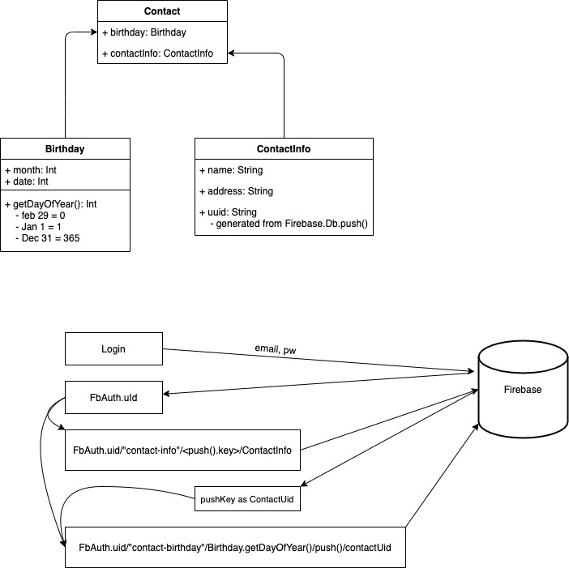

# BdayPost

Get reminders to send cards for Special Events

## Firebase

### Firebase auth

Firebase auth API is utilized for Login/Register.

#### Login

- email/pw: currently supported
- fb login: future supported? Maybe can pull bday data from this?

#### Register

```
suspend fun register(email: String, password: String, displayName: String): Result<String> {
        val authResult = dataSource.register(email, password)
        if (authResult is Result.Success) {
            if (displayName.isNotBlank()) {
                dataSource.changeDisplayName(displayName)
            }
            return Result.Success(authResult.data.user?.uid ?: "")
        } else {
            return Result.Error((authResult as Result.Error).exception)
        }
    }
```

1. Saves the email/password -> generates a Firebase.User
2. (Optional) Save a display name for the Firebase.User

### Firebase Database

Relies on the user being authenticaed, so we can assume `FirebaseAuth.User.UID != null`

#### Add Contact and Birthday



- Birthday has Month and date

  - birthday has a method to convert the month,date into a date range of 0-365
    - **date 0 is assumed to be Feb 29**
    - Jan 1 = 1 ... Dec 31 = 365 (excluding Feb 29)

- Contact Info
  - has name and address
  - generates a UUID from saving into firebaseDatabase with a push()

Flow:

1. Login/Register gives the FirebaseAuth.UserId
2. Save the new contact Info filled in
   - contactUUID = FirebaseDb.push()
   - endpoint: `UserId/"contact-info"/contactUUID/ContactInfo(name, addr)`
3. Save new contact birthday
   - birthDate = Birthday.getDayOfYear()
   - nodeId = push() - used to save lists of objects without clashing but not used as meaningful id
   - endpoint: `UserId/"contact-birthday"/birthDate/nodeId/contactUUID
